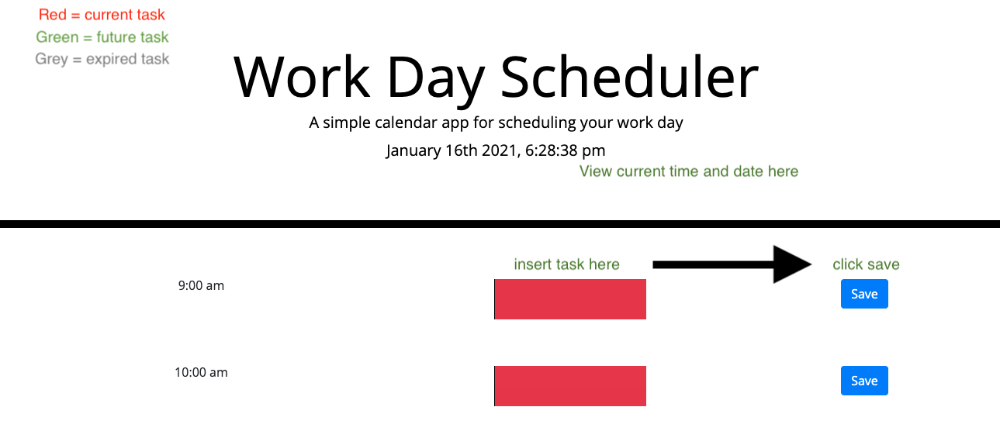
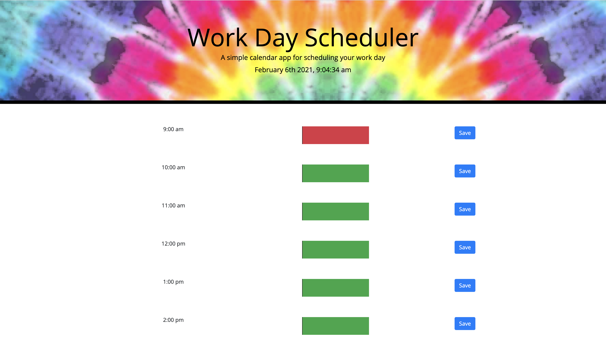
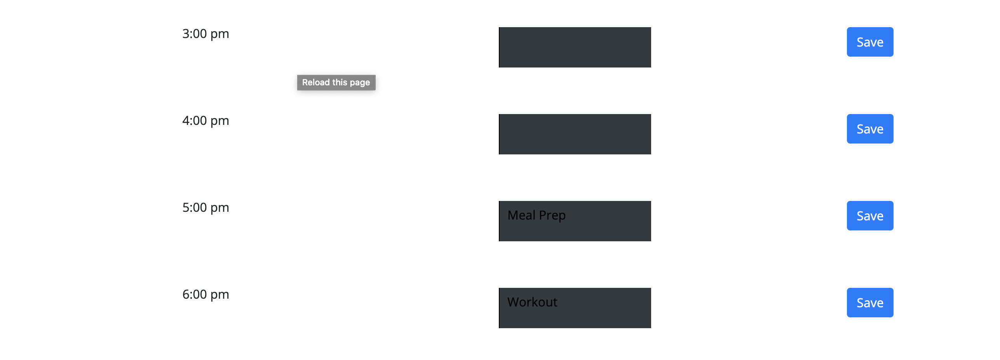

# Day-Planner

## Table of Contents 
* [Description](#description)
* [User Story](#story)
* [Acceptance Criteria](#criteria)
* [Usage](#usage)
* [Installation](#installation)
* [Deployed Link](#deployed)
* [License](#license)
* [Contact](#contact)

## Description

The day planner is a way for the user to quickly add tasks throughout the work day. When the user opens the page the application displays a series of input boxes that are red, green or grey depending upon the time of the day. The red input boxes are for future tasks, the green are for current tasks and the grey are for expired tasks. Located on the left of the input boxes are times that indicate when the user plans to complete the task. Located on the right of the input boxes are save buttons which allows the user to save the tasks, even when they refresh, the tasks do not go away. In addition to them clicking the save button the tasks are stored on the local storage. In order to build this app I used a combination of HTML, CSS boostrap, Javascript and jQuery. Some of the challenges I faced were creating a for loop to change the color of the input boxes depending on the current time.

My motivation for building this application was to give the user an easy way to log a to-do list that they can monitor throughout the work day. It solves the problem of writing the tasks down and losing the paper, trying to remember tasks off the top of your head and also color codes so the user is able to differntiate what is due and when. 

My biggest take-away from this project is jQuery is an extremely simplifeid way to code in javascript. It saves a lot of time and displays the code in a way that is easier to read for another developer, grader, etc. I also learned that using different javascript libraries is a quick way to use a reference for a variable. For example, if the coder would have to come up with the current time on their own, instead of using the reference it would take significatly longer.  


## Story 

```
AS AN employee with a busy schedule
I WANT to add important events to a daily planner
SO THAT I can manage my time effectively
```

## Criteria

```
GIVEN I am using a daily planner to create a schedule
WHEN I open the planner
THEN the current day is displayed at the top of the calendar
WHEN I scroll down
THEN I am presented with time blocks for standard business hours
WHEN I view the time blocks for that day
THEN each time block is color-coded to indicate whether it is in the past, present, or future
WHEN I click into a time block
THEN I can enter an event
WHEN I click the save button for that time block
THEN the text for that event is saved in local storage
WHEN I refresh the page
THEN the saved events persist
```

## Usage 
Wireframe: 


Deployed application:


When user refreshes page, to-do list is saved: 


## Installation 
* Created index.html, style.css, script.js and assets folder (images)
* Linked bootstrap ref, moment.js, javascript and jQuery files to index.html
* Created time blocks using bootstrap in index.html
* In javascript file, pulled data from moment.js to display current date and time 
* In javascript file, created a #saveBtn function to store user input and current time selection into local storage 
* In javascript file, created a for loop to change the color of the input boxes to red, green or grey according to the current time 
* Added styling on index.html using assets folder and other basic CSS techniques 

## Deployed 
https://sfinck.github.io/day-planner/

## License 
[](https://opensource.org/licenses/MIT)

## Contact 
sarahfinck95@gmail.com